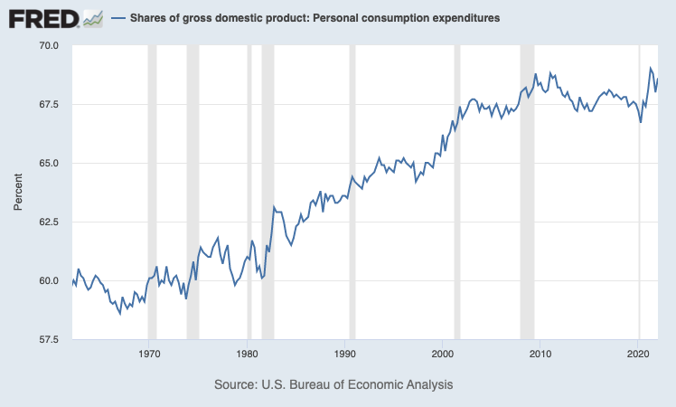
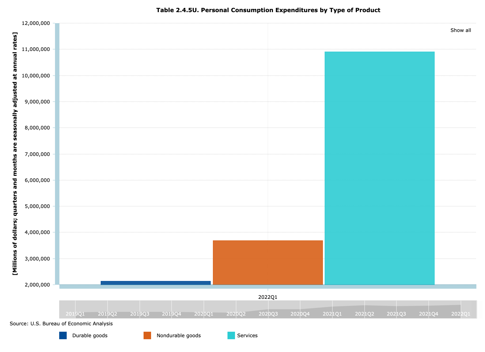
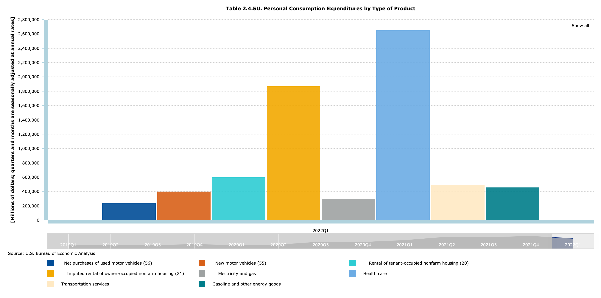
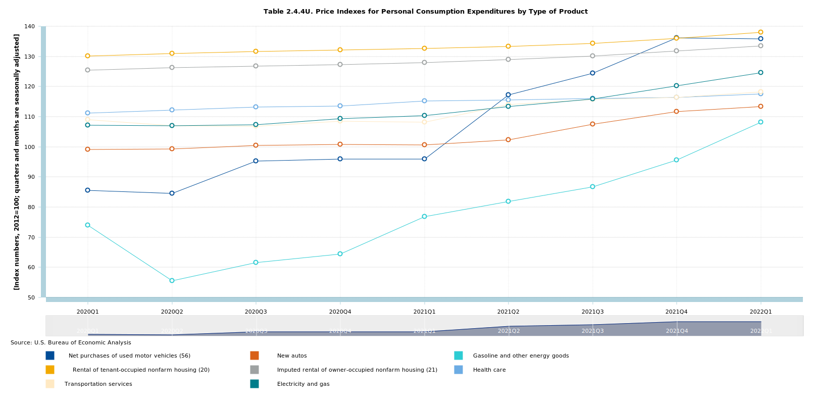

# inflation
This repo houses R scripts and csvs used to decompose inflation and visualize that decomposition. 

Inflation is measured using the Bureau of Economic Analysis's (BEA) measure, Personal Consumption Expenditure (PCE).

The contribution of inflation to overall trends is weighted using Table 2.4.5U. Personal Consumption Expenditures by Type of Product.

## PCE

PCE is the share of GDP that is associated with consumption in an expenditure based definition of GDP - i.e., Y = C + I + G + X - I. This share of GDP has seen a relatively monotonic rise over the last half century. The difference between PCE as a share of GDP in the mid-1970s and today raises questions about its ability to be used for purposes of comparison between the two periods. However, the same concerns could reasonably be raised for CPI. 

## PCE product type catergories

PCE is decomposed into product type catergories. The broad product types catergories are durable good, non-durable goods, and services. Each of these product type catergories can be further decomposed. 

## Preferred product type catergory decomposition

The BEA decomposes PCE into relatively granular subcatergories; this content is housed in [Table 2.4.5U. Personal Consumption Expenditures by Type of Product](https://apps.bea.gov/iTable/iTable.cfm?reqid=19&step=3&isuri=1&1921=underlying&1903=2017#reqid=19&step=3&isuri=1&1921=underlying&1903=2017). 

Our preferred product type catergory decomposition for the purposes of making sense of contemporary inflation focuses on the following subcatergories: 
  Imputed rental of owner-occupied nonfarm housing (services)
  Rental of tenant-occupied nonfarm housing (services)
  New motor vehicles (durable goods) 
  Net purchases of used motor vehicles (durable goods)
  Transportation services (services)
  Electricity and gas (services) 
  Gasoline and other energy goods (non-durable goods)
  Health care (services)
 
 
 
 ## PCE price indexes
 
 PCE price indexes for each PCE catergory and subcatergory are housed in [Table 2.4.4U. Price Indexes for Personal Consumption Expenditures by Type of Product](https://apps.bea.gov/iTable/iTable.cfm?ReqID=19&step=2#reqid=19&step=2&isuri=1&1921=underlying)

 
 ## References
 
[Brookings](https://www.brookings.edu/blog/up-front/2022/05/18/how-does-the-consumer-price-index-account-for-the-cost-of-housing/)
 
[New York Fed](https://libertystreeteconomics.newyorkfed.org/2022/04/inflation-persistence-how-much-is-there-and-where-is-it-coming-from/)

[St.Louis Fed](stlouisfed.org/on-the-economy/2022/mar/breaking-down-contributors-high-inflation)

Stock, James H., and Mark W. Watson. "Core inflation and trend inflation." Review of Economics and Statistics 98.4 (2016): 770-784.
