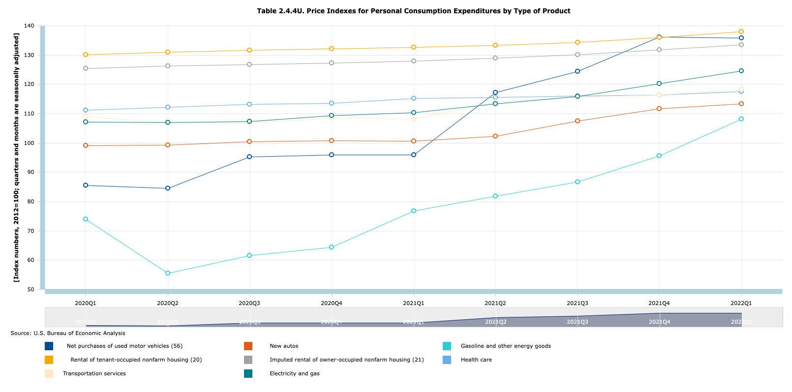

# inflation
This repo houses R scripts and csvs used to decompose inflation and visualize that decomposition. 

Inflation is measured using the Bureau of Economic Analysis's (BEA) measure, Personal Consumption Expenditure (PCE).

The contribution of inflation to overall trends is weighted using Table 2.4.5U. Personal Consumption Expenditures by Type of Product.

## PCE

PCE is the share of GDP that is associated with consumption in an expenditure based definition of GDP - i.e., Y = C + I + G + X - M. This share of GDP has seen a relatively monotonic rise over the last half century. The difference between PCE as a share of GDP in the mid-1970s and today raises questions about its ability to be used for purposes of comparison between the two periods. However, the same concerns could reasonably be raised for CPI. PCE does not include expenditure related to the purchase of residential real estate; such purchases are in the category Gross private domestic investment. 

## PCE product type catergories

PCE is decomposed into product type catergories. The broad product types catergories are durable good, non-durable goods, and services. Each of these product type catergories can be further decomposed. 

## Preferred product type catergory decomposition

The BEA decomposes PCE into relatively granular subcatergories; this content is housed in [Table 2.4.5U. Personal Consumption Expenditures by Type of Product](https://apps.bea.gov/iTable/iTable.cfm?reqid=19&step=3&isuri=1&1921=underlying&1903=2017#reqid=19&step=3&isuri=1&1921=underlying&1903=2017). 

Our preferred product type catergory decomposition for the purposes of making sense of contemporary inflation focuses on the following subcatergories: 
  Imputed rental of owner-occupied nonfarm housing (services)
  Rental of tenant-occupied nonfarm housing (services)
  New motor vehicles (durable goods) 
  Net purchases of used motor vehicles (durable goods)
  Transportation services (services)
  Electricity and gas (services) 
  Gasoline and other energy goods (non-durable goods)
  Health care (services)
  
 
 
 ## PCE price indexes
 
 PCE price indexes for each PCE catergory and subcatergory are housed in [Table 2.4.4U. Price Indexes for Personal Consumption Expenditures by Type of Product](https://apps.bea.gov/iTable/iTable.cfm?ReqID=19&step=2#reqid=19&step=2&isuri=1&1921=underlying)

 
 
 ## Housing component of inflation
 
 1) Forces specific to rental markets: a) renters having more cash on hand due to UI, stimulus, and rental assistance programs, b) more churn in the rental market allowing for prices to increase (think of more people breaking leases or not renewing) - prices become less sticky, c) people fanning out from high rent cities to lower rent places and holding different reservation prices d) all in the context of pre-covid tendencies for greater concentration in rental markets. 

2) Forces specific to real-estate markets: a) lower interest rates due to fed policy and, possibly, other covid relevant forces that pushed down interest rates, b) increased demand for houses due to covid (eg moving to the suburbs or deciding to invest now), c) forces specific to “demographics” - millennials at the age where they begin to invest, d) robust job market due to massive stimulus leading to increased demand for housing, e) all within the context of pre-covid real-estate asset price inflation tendencies (which I’ll layout in the next text)

Forces specific to real-estate markets have influence on rental markets for the simple reason that they are dealing in the same product. If the net present discounted value of rents are not equivalent to the sale price of the same unit, there is an opportunity cost to keep the unit/house as a rental rather than sell it. Therefore, there is a tendency for rental prices to increase as real-estate prices. 

*pre-covid forces related to asset price inflation in real-estate markets: Step 1) Income inequality increases; Step 2) The rich save/invest a greater share of their income than lower incomes people, and in turn invest in assets (including real-estate); Step 3) Unlike financial assets, the supply of real estate is relatively inelastic (e.g., there is only so much land), therefore with more money cashing after the relatively same amount of stock, prices are pushed upward; Step 4) As prices of these assets increase, the owners of real estate assets have more wealth, and via more wealth they see more capital income (e.g., via ground rents or through realized capital gains from the sale of their real estate); Step 5) With more capital income from real estate (which is concentrated at the top of the distribution), a greater share of national income is re-invested in real estate; Step 6) These processes loop and reinforce themselves, further pushing up real estate asset prices. 

 ## References
 
[Brookings](https://www.brookings.edu/blog/up-front/2022/05/18/how-does-the-consumer-price-index-account-for-the-cost-of-housing/)
 
[New York Fed](https://libertystreeteconomics.newyorkfed.org/2022/04/inflation-persistence-how-much-is-there-and-where-is-it-coming-from/)

[St.Louis Fed](stlouisfed.org/on-the-economy/2022/mar/breaking-down-contributors-high-inflation)

Bauer, Andrew, Nicholas Haltom, and William Peterman. "Decomposing Inflation." Federal Reserve Bank of Atlanta Economic Review (2004): 39-51. 

Stock, James H., and Mark W. Watson. "Core inflation and trend inflation." Review of Economics and Statistics 98.4 (2016): 770-784.
